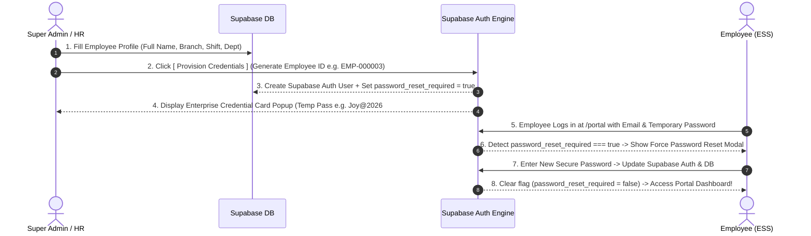
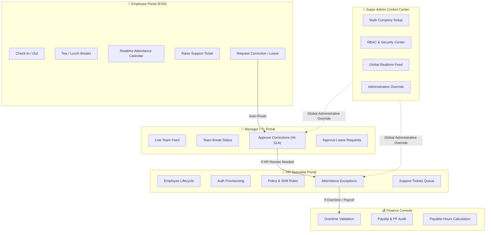
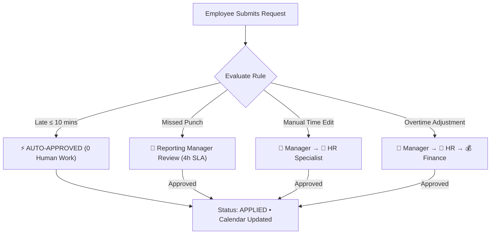

# JRM HRMS Enterprise Architecture & Workflows
**Joy Corporate Solutions Pvt. Ltd.** • *Joy Resources Management HRMS*

> [!NOTE]
> This document details the complete end-to-end architecture, role-based portal inter-connections, realtime data synchronization, authentication pipelines, critical system safeguards, and UX/animation enhancement roadmap.

---

## 1. Unified Authentication & Identity Provisioning Flow

Every employee in **Joy Corporate Solutions Pvt. Ltd.** follows a zero-mock, single-source-of-truth identity lifecycle powered by Supabase Authentication and RLS Database tables.



### Authentication Features:
1. **Editable Official Email**: Official employee login emails (e.g. `thirumalai@joycorporate.in`) sync instantly across `public.employees` and `public.employee_accounts`.
2. **First-Login Security Policy**: Mandatory modal forces employees to change temporary HR-assigned passwords before entering their dashboard.
3. **Role-Based Access Control (RBAC)**: Maps Auth UID to `employee_accounts.role` (`Employee`, `TeamLead`, `ReportingManager`, `HRSpecialist`, `Finance`, `Reception`, `ITSupport`, `SuperAdmin`).

---

## 2. Role-Based Portals & Inter-Connected Workflow Matrix

The enterprise architecture divides responsibilities cleanly so Super Admin never manually approves routine daily requests:



### Role Matrix Summary:

| Role | Access Scope | Core Responsibilities | Can Approve? |
| :--- | :--- | :--- | :--- |
| **Employee (ESS)** | Own Profile & Data | Check-In/Out, Start Breaks, View Calendar, Raise Tickets, Request Corrections | ❌ No |
| **Team Lead** | Direct Team | View Team Live Status, Monitor Team Breaks, Approve Team Attendance | ✅ Team Only |
| **Reporting Manager** | Entire Department | Approve Corrections, Approve Leave, Department Attendance Analytics | ✅ Department |
| **HR Specialist** | All Employees | Employee Provisioning, Shift Rules, Document Approvals, Helpdesk Support | ✅ HR Scope |
| **Reception** | Entrance Kiosk & Visitors | Mantra Biometric Kiosk, Visitor Pass Approval, Gate Log | ✅ Visitor Passes |
| **IT Support** | Device Hardware & Tech | Biometric Scanner Health, Terminal Logs, Laptop/VPN Support Tickets | ✅ IT Tickets |
| **Finance** | Payroll & Compensation | Overtime Validation, Salary Slip Generation, Payable Hours Audit | ✅ Overtime/Payroll |
| **Super Admin** | Whole Enterprise | System Configuration, Subscriptions, Audit Logs, Security Overrides | ⚡ Global Override |

---

## 3. Realtime Data Architecture (0 Refresh • 0 Mock Data)

```
  ┌─────────────────────────────────────────────────────────────┐
  │ 1. BIOMETRIC CAPTURE / USER EVENT                           │
  │ • Mantra MFS110 L1 USB Scanner (ISO 19794-2 Minutiae)       │
  │ • Web Terminal / Kiosk / Portal Button Click                │
  └──────────────────────────────┬──────────────────────────────┘
                                 │
                                 ▼
  ┌─────────────────────────────────────────────────────────────┐
  │ 2. LOCAL 1:N BIOMETRIC ENGINE (/api/biometrics/search)     │
  │ Compares minutiae array against Supabase database           │
  │ Match confidence score: 99.4%                               │
  └──────────────────────────────┬──────────────────────────────┘
                                 │
                                 ▼
  ┌─────────────────────────────────────────────────────────────┐
  │ 3. SUPABASE DB TRANSACTION & REALTIME PUBLICATION           │
  │ Writes to:                                                  │
  │ • public.attendance_events                                  │
  │ • public.attendance_records                                 │
  │ • public.support_tickets                                    │
  │ • public.workflow_requests                                  │
  │ Realtime Channels broadcast to ALL active portals instantly!│
  └──────────────────────────────┬──────────────────────────────┘
                                 │
                                 ▼
  ┌─────────────────────────────────────────────────────────────┐
  │ 4. MULTI-PORTAL INSTANT UI REPAINT                          │
  │ • Employee Calendar repaints cell color                      │
  │ • Manager Portal updates team present count                 │
  │ • HR Console updates live feed & plays sound chime           │
  │ • Super Admin Dashboard heatmaps update                     │
  └─────────────────────────────────────────────────────────────┘
```

---

## 4. Smart Workflow Approval Engine

To prevent Super Admin bottlenecking, requests follow automated severity rules:



---

## 5. Critical Areas & System Safeguards Audit Checklist

> [!IMPORTANT]
> The following technical safeguards ensure enterprise security, performance, and stability:

1. **Hardware Driver Integration**:
   - [`lib/biometrics/mantra-rd.ts`](file:///f:/TEST%20LIVE%20ATTENDANCE/lib/biometrics/mantra-rd.ts) connects directly to local Mantra RD Service (`http://127.0.0.1:11100`). Zero mock fingerprints.
2. **Database Security Invoker Views**:
   - `v_realtime_net_working_hours` defined `WITH (security_invoker = true)` to respect Row Level Security policies.
3. **Idempotent Realtime Event Processing**:
   - Prevents duplicate UI event repaints using unique event IDs (`LOG-EVT-TIMESTAMP-RANDOM`) and set de-duplication.
4. **Pre-Launch Calendar Handling**:
   - Past untracked dates prior to onboarding display as neutral **`No Record`** tiles, ensuring 0 false absent days on launch day.

---

## 6. UI/UX Enhancement & Animation Roadmap

To wows users with a state-of-the-art visual aesthetic:

### Recommended UX & Animation Enhancements:
- 🎨 **Glassmorphism Workspace Cards**: `bg-slate-900/80 backdrop-blur-2xl border border-slate-800/80 shadow-2xl`
- ⚡ **Micro-Animations**: Smooth entry transitions (`animate-in fade-in zoom-in-95 duration-200`) on modals, drawers, and tabs.
- 🔴 **Live Ticking Session Timers**: Real-time counter ticking every second during active work sessions (`Checked In • Working 04h 12m 35s`).
- 🔔 **Audio Feedback Engine**: Gentle, non-intrusive sound chimes when receiving realtime helpdesk replies or biometric approvals (`playSuccessChime()`).
- 🌟 **CSAT Rating Widget**: 5-Star interactive rating component for resolved tickets and completed workflows.
